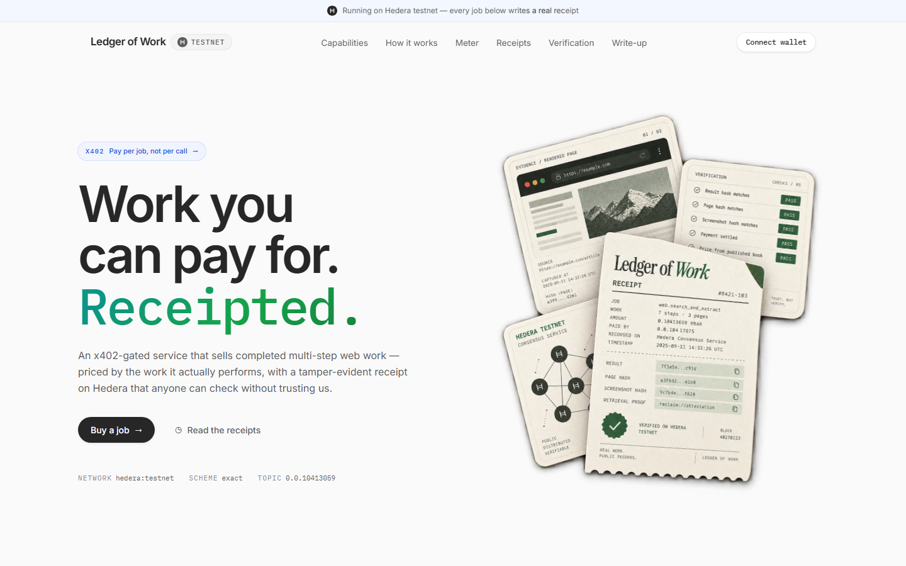
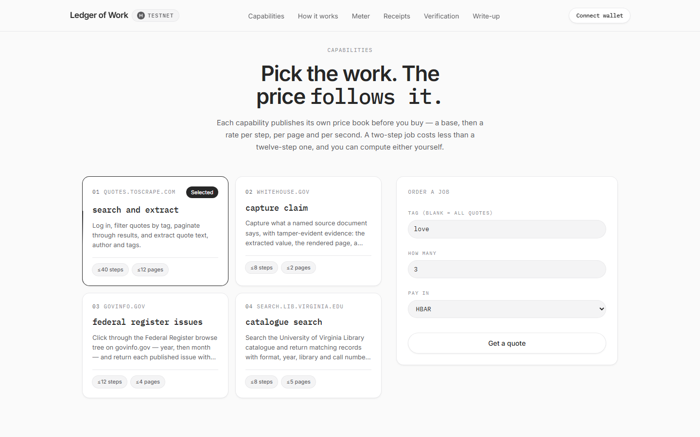
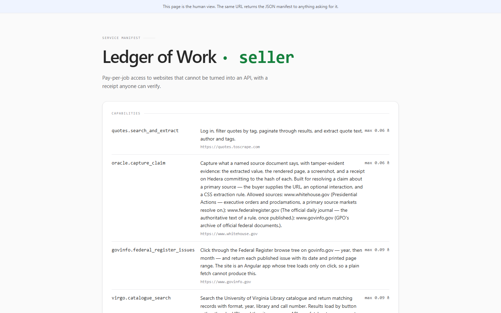
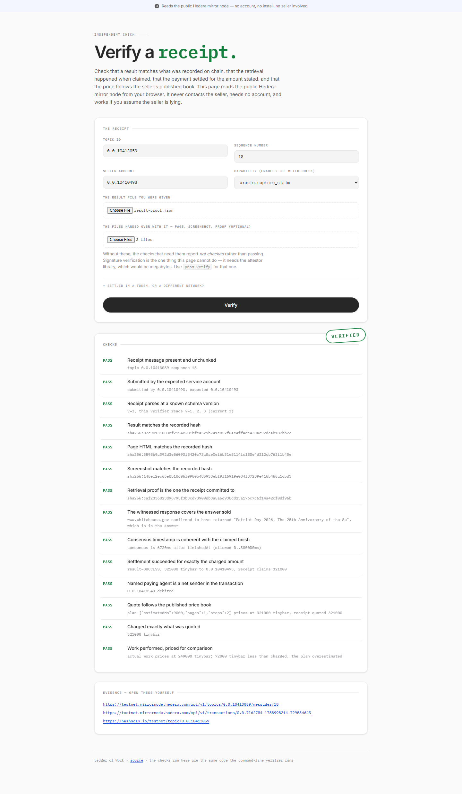
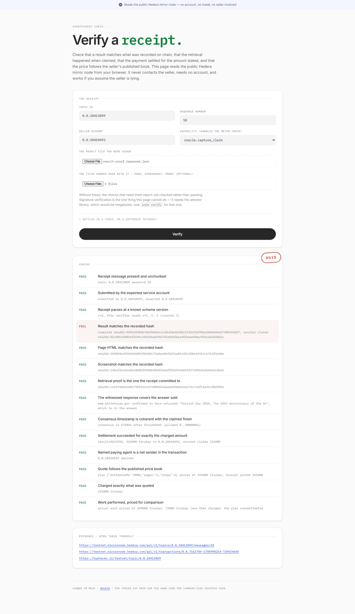

# Ledger of Work

**A live x402-gated service on Hedera that sells multi-step web work, priced by the work
it actually performs — and an agent that discovers it and pays for it with no API key, no
account, and no prior relationship.**

Every job leaves a receipt on Hedera Consensus Service that anyone can check without
trusting the seller. Settlement runs through the [Blocky402](https://blocky402.com/)
facilitator on Hedera testnet.



## Live right now

| | URL | What it is |
| --- | --- | --- |
| **Service** | [seller-production-d5ab.up.railway.app](https://seller-production-d5ab.up.railway.app) | The x402-gated seller. Returns its manifest as JSON to agents, as a page to browsers. |
| **Buyer** | [web-production-187614.up.railway.app](https://web-production-187614.up.railway.app) | Order a job, watch the meter, pay from your own wallet. |
| **Verifier** | [verifier-production-0199.up.railway.app](https://verifier-production-0199.up.railway.app) | Check any receipt against the public mirror node. No account, no install. |
| **Receipts** | [topic `0.0.10413059`](https://hashscan.io/testnet/topic/0.0.10413059) | 47 real jobs, quoted, paid and recorded on chain. |
| **Directory** | [topic `0.0.10473320`](https://hashscan.io/testnet/topic/0.0.10473320) | An open agent directory with no submit key — anyone may list. |

## See it charge you, in one command

No install, no key, no account. Ask for a quote, then call the job and read the 402:

```bash
SELLER=https://seller-production-d5ab.up.railway.app

RUN=$(curl -s -X POST $SELLER/jobs -H 'content-type: application/json' \
  -d '{"capability":"quotes.search_and_extract","params":{"tag":"love","max":3}}' \
  | python -c "import json,sys; print(json.load(sys.stdin)['run'])")

curl -s -i -X POST "$RUN" | grep -i payment-required
```

Which answers, from the live service:

```http
HTTP/1.1 402 Payment Required
payment-required: {"x402Version":2,"accepts":[{"scheme":"exact","network":"hedera:testnet",
  "amount":"312000","payTo":"0.0.10410493","maxTimeoutSeconds":300,"asset":"0.0.0",
  "extra":{"feePayer":"0.0.7162784"}}]}
```

**That `amount` is not a flat fee.** It was computed from a plan — three steps, one page —
against a price book published before the job ran. Change `max` and watch it track the
work rather than the request:

| Asked for | Plan | Price |
| --- | --- | --- |
| 3 quotes | 3 steps, 1 page | 312,000 tinybar |
| 10 quotes | 3 steps, 1 page | 312,000 tinybar |
| 40 quotes | 4 steps, 2 pages | 456,000 tinybar |

Ten costs the same as three because ten still fit on one page — the seller does no more
work, so it charges no more. Forty needs a second page, and the price moves. The meter
prices *pages traversed and steps taken*, not items requested, which is the difference
between metering and a tariff. See [How it works](#how-it-works).

To go the rest of the way and actually pay, `pnpm agent` runs a buying agent that finds
the service in the on-chain directory, reads its price book, pays and verifies — knowing
nothing at the start but a topic id. See [An agent that finds this and pays it](#an-agent-that-finds-this-and-pays-it-knowing-nothing).

## What is for sale



Four capabilities, all against **real sites that have no usable API** — a government
publications archive, a university library catalogue, whitehouse.gov, and a login-gated
sandbox. Each is a multi-step browser job: log in, search, filter, paginate, extract.

The seller publishes its own manifest, and will render it for a person or hand it to an
agent as JSON depending on what you ask for:



## Verification is the point

Anyone can check a receipt without an account, without installing anything, and without
asking the seller for permission — the page reads the public Hedera mirror node from your
browser and runs the same code as the command-line verifier.

Here is receipt **18** with the files it committed to. Fourteen checks, all green,
including a zkTLS attestor's signature over the source response:



Now the same receipt, the same page, the same screenshot, the same proof — with **one
character** of the answer changed:



Thirteen checks still pass. The payment settled, the price follows the published book, the
page and screenshot and retrieval proof are all intact. One check fails, and the verdict is
**VOID**. That is the whole product in two pictures.

**Reproduce both verdicts yourself.** Everything needed is committed in
[`samples/`](samples/) — you do not have to buy a job first. On
[the verifier](https://verifier-production-0199.up.railway.app), enter:

| Field | Value |
| --- | --- |
| Topic id | `0.0.10413059` |
| Sequence number | `18` |
| Seller account | `0.0.10410493` |
| Capability | `oracle.capture_claim` |
| Result file | `samples/result-proof.json` |
| The files handed over with it | `samples/result-proof.page.html`, `samples/result-proof.screenshot.png`, `samples/result-proof.proof.json` |

That gives **VERIFIED**. Now swap the result file for
`samples/result-proof.tampered.json` — the same job with one character changed — and the
same inputs give **VOID**.

## How this maps to the track

| Qualification | Where |
| --- | --- |
| Live x402-gated service on Hedera, settled through Blocky402 | [the seller](https://seller-production-d5ab.up.railway.app), `apps/seller` — `/health` reports the facilitator |
| A platform or agent that consumes it, ≥1 real paid request | 47 paid jobs on [topic `0.0.10413059`](https://hashscan.io/testnet/topic/0.0.10413059); `apps/buyer-cli`, `apps/web`, `scripts/agent-discover-and-buy.mjs` |
| Public repo with setup, architecture and payment flow | this file — [Try it](#try-it), [How it works](#how-it-works) |
| Demo video ≤ 5 minutes | [`docs/DEMO.md`](docs/DEMO.md) is the script it follows |

| Extra credit | Where |
| --- | --- |
| Metering rather than a flat per-request charge | [How it works](#how-it-works) — priced per step, per page and per second against a published book |
| A2A / ACP negotiation and settlement | `/.well-known/agent-card.json`, generated from the same specs the seller prices from |
| On-chain agent identity — ERC-8004 or HCS-14 | `packages/identity` — HCS-14 UAID, SHA-384 over six canonical fields |
| Agent discovery via a directory | [topic `0.0.10473320`](https://hashscan.io/testnet/topic/0.0.10473320), open, no submit key |
| HTS tokens in the settlement path | 4 of the 47 receipts settle in a `WORK` HTS token rather than HBAR |
| Verifiable payment audit trails on HCS | the receipts, and [the verifier](https://verifier-production-0199.up.railway.app) that reads them |
| Recurring payments via Scheduled Transactions | `scripts/standing-order.mjs` — HIP-423, two executed 37 seconds apart |

## Honest limits

Stated here rather than buried, because a project about verifiable claims should be
checkable about its own.

- **One paying account.** All 47 receipts were paid by `0.0.10410543`, which is ours. The
  system works; it has not yet been used by a stranger.
- **A witness, not mathematics.** A retrieval proof says an independent attestor observed
  the TLS session. Compromise the attestor and it is worth what any signature from a
  compromised key is worth.
- **It does not prove the site was right.** If the source was wrong, the receipt records a
  wrong answer perfectly. Nothing here is a fact-checker.
- **Not every capability carries a proof.** Receipts without one are reported as unproven
  rather than fine — the verifier never treats a missing check as a passing one.
- **The directory contains a stale entry.** An early test published `http://localhost:8402`
  before the service was hosted. The topic is append-only and has no submit key, by
  design, so it cannot be deleted — readers fold to the newest entry per agent id, which
  is exactly the case the fold exists to handle.

## What the receipt proves, and what it does not

Read this before anything else, because the distinction is the whole product.

**It proves** — each of these is a check the verifier runs, and each can fail:

- the answer you hold is the answer that was recorded; change one character and it fails
- the record was written when it claims, and cannot be backdated
- the payment settled for exactly the amount stated
- the price follows a price book published *before* the job ran
- the job was recorded by the seller's account, not forged by a third party

**It does not prove the site was right.** If the source itself was wrong, the receipt
records a wrong answer perfectly. Nothing here is a fact-checker.

**And until recently it did not prove the seller went to the source at all.** Every hash
above is taken over something the seller produced, so a seller willing to fabricate an
answer could hash the fabrication faithfully and pass every check. Two things now stand
in the way of that:

**The evidence bundle**, on every receipt: a hash of the **fully rendered page** and a
**full-page screenshot**, with both files handed to the buyer. Faking a job means
producing a convincing page and a matching screenshot a human can open and look at,
rather than editing one field in a JSON file. Each is checked independently — flip a
single bit in the screenshot and that check goes red while the result and page stay
green. This raises the cost of lying; it does not make lying impossible.

**The retrieval proof**, on capabilities that can carry one: an independent
[Reclaim](https://reclaimprotocol.org/) attestor opens the TLS session alongside the
worker and signs that the response from the source contained the answer. This is the only
commitment on the receipt that is not ours — we cannot forge it, because we do not hold
the attestor's key. See [Proving retrieval](#proving-retrieval-not-just-delivery).

Even with a proof, the honest claim is **a witness, not mathematics**: "an independent
attestor observed this TLS session", not "this is unforgeable". Compromise the attestor
and the signature is worth what any signature from a compromised key is worth. And a
receipt that carries *no* proof is reported as unproven rather than fine — the verifier
never treats a missing check as a passing one.

## Why web jobs

Because they are the worst case, which makes them the right demonstration.

**Most of the web has no usable API.** An agent that needs a number off a site has to log
in, type into a search box, apply filters, page through results, and read one value at the
end. That isn't a fetch — it's a job. Every existing pay-per-call service prices a single
page fetch, so multi-step work is unserved.

**And nobody can check the result.** There is no invoice, no audit trail, nothing tying
the bytes to a retrieval event. If that can be made checkable here, it can be made
checkable anywhere.

## How it works

**The worker** runs a defined multi-step flow against a target site — log in, search,
filter, paginate, extract — and returns structured output.

**The meter** derives price from work done: steps executed, pages traversed, session
time. A two-step job costs less than a nine-step one, and the unit prices are published
in advance so a buyer can compute the price themselves.

**The receipt** records, for every job: hashes of the result, the rendered page, a
screenshot and — where one could be obtained — an attestor's retrieval proof, plus the
source URLs, timestamps, which capability ran, the work performed, the price charged, the
payment reference, and the paying agent. Hashes rather than payloads, so integrity is
provable without republishing content that isn't ours to redistribute, and so the whole
record fits the 1024 bytes an HCS message gets before it is split into chunks the mirror
REST API will not reassemble.

**The capability that has a buyer** is `oracle.capture_claim`: name a source document, a
CSS rule, and optionally something to click, and get back what it says with the whole
evidence bundle behind it. Built for settling a dispute about a primary source — the case
where [a $7M prediction-market resolution](https://orochi.network/blog/oracle-manipulation-in-polymarket-2025)
came down to a link and a screenshot nobody could check. Sources are allowlisted, and the
list only grows by someone reading a site's robots.txt first.

## Proving retrieval, not just delivery

[zkTLS](https://blog.reclaimprotocol.org/posts/zk-in-zktls) proves that a byte-string
genuinely came from a site's TLS session — exactly the thing a hash of our own output
cannot do. The obstacle looked fatal: zkTLS proves a *single* HTTPS response, while these
jobs are multi-step browser sessions.

The resolution is a split: **the browser does the navigating; the attestor proves the one
response that carries the answer.** For `oracle.capture_claim` that is the document
itself.

It works, on testnet, today. Receipt
[seq 18](https://hashscan.io/testnet/topic/0.0.10413059) verifies 15/15, including a
signature from attestor `0x2448…9072`. Three separate checks have to hold:

| Check | Catches |
| --- | --- |
| the proof is the one the receipt committed to | a genuine proof of some *other* page swapped in afterwards |
| an independent attestor signed it | a forged or edited proof |
| the witnessed response covers the answer sold | witnessing a real page while returning something it does not say |

All three were confirmed by breaking them. Flipping one bit of the signature fails two.
Substituting a different *genuine* proof fails only the first — its signature is real,
which is precisely why the commitment has to exist. Supplying no proof fails all three as
"not checked".

**What it costs, measured.** Proof time tracks what has to stay *hidden*, not response
size:

| Target | Size | Time | Why |
| --- | --- | --- | --- |
| whitehouse.gov, public GET | 263 KB | **2.1s** | nothing to hide, so no ZK proving at all |
| Virgo search, bearer token | 40 KB | 28s | 25s generating 8 ZK proofs to keep the token secret |

That is why `oracle.capture_claim` is wired up and the credentialed capabilities are not:
2 seconds fits inside a paid request and 28 does not. `packages/proof` is the wrapper;
`scripts/spike-zktls*.mjs` are the throwaway spikes that established the numbers, kept
because they are the evidence for them.

**Limits, stated rather than discovered.** It proves the answer-bearing response, not the
clicking that reached it. It needs a source whose answer arrives in one response — a
client-rendered page has none, and the adapter returns null rather than attempting it. And
the witness is a third party, with everything that implies.

## Being found, and being paid on a schedule

Four things an agent needs that a manifest alone does not give it.

**A name that is not an address.** The service publishes an
[HCS-14](https://hol.org/docs/standards/hcs-14/) universal agent id, derived from what it
*is* — name, version, protocol, Hedera account — and not from where it is hosted. Two
agents that meet it through different channels compute the same identifier without
consulting any registry, and it survives a change of host:

```
uaid:aid:4Qsy3gHWJbC7GChe8WhWnmFXNLkTpuucn36TW4HgtaQyDU1MgAnEiWhpYsohHGwJ7B
  ;uid=0;registry=ledger-of-work;proto=a2a;nativeId=hedera:testnet:0.0.10410493
```

Base58 of a SHA-384 over six canonical fields. `packages/identity` computes it, and the
tests recompute it the long way rather than asserting our own output — the whole value is
that a stranger derives the same string.

**A card in the shape other agents read.** `/.well-known/agent-card.json` serves an
[A2A](https://a2a-protocol.org/) agent card, generated from the same specs the seller
prices and executes from. Each capability becomes a skill with a price floor, so an agent
can rank providers before spending a quote round trip. It declares `x402` as its interface
rather than implying an A2A task endpoint it does not serve.

**A directory with nobody in charge.** Services list themselves on an open HCS topic
([`0.0.10473320`](https://hashscan.io/testnet/topic/0.0.10473320)) that has **no submit
key** — anyone can add themselves, nobody can delete an entry, and reading it needs no
account:

```bash
pnpm registry list                      # who is out there
pnpm registry find --skill oracle       # who sells what you need
pnpm registry publish --url https://…   # add yourself
```

A directory you have to trust the operator of would be a strange thing to put in front of
a project whose claim is that you need not trust the seller. Every entry carries the
account that posted it; each names the receipts topic where its history can be checked.

**Payment on a schedule, not per call.** x402 settles one job at a time, which suits a
stranger buying once and suits an agent buying hourly rather badly. `pnpm standing-order`
creates a run of [Hedera Scheduled
Transactions](https://docs.hedera.com/learn/core-concepts/transactions/scheduled) — each
signed now, each executing at its own future second:

```
  1/2  0.0.10473347  executes 2026-09-11T08:49:21Z   ->  EXECUTED
  2/2  0.0.10473349  executes 2026-09-11T08:49:58Z   ->  EXECUTED
```

`setWaitForExpiry(true)` is what makes it a standing order rather than a burst: without
it a single-signature transfer executes the moment it is signed, so all of them fire at
once. The buyer's funds stay in the buyer's account until each moment arrives, and the
seller can verify the whole run exists and is signed — over the public mirror node,
holding nobody's key — before doing any work.

## An agent that finds this and pays it, knowing nothing

```bash
pnpm agent --need oracle --budget 500000
```

No URL, no API key, no account, no prior relationship. A topic id and a sentence:

```
1. reading the directory (topic 0.0.10473320) — no key, no account
   cheapest    oracle.capture_claim from 204000 tinybar
2. fetching its agent card
   identity    matches the listing
3. asking for a quote
   quoted      321000 tinybar   budget 500000 — proceeding
4. paying the 402
   receipt     topic 0.0.10413059 seq 31
5. verifying the receipt against the ledger
   VERIFIED — 15/15 checks
```

Give it a budget the job will not fit inside and it walks away at step 3, before paying
anything — which is the point of a price you can read before you commit.

Step 5 is what makes the other four safe. Discovery hands you an address a stranger
posted; the receipt is what tells you the thing at that address did the work and charged
what it said it would.

## Status

**Working end to end on Hedera testnet.** Forty-seven real jobs have been quoted, paid
for through the Blocky402 facilitator, executed against live sites, receipted on HCS and
independently verified — across five capabilities, four of them settled in an HTS token
rather than HBAR, four carrying an independent attestor's signature over the source
response, and including one that failed and was charged nothing.

| Component | State |
| --- | --- |
| `packages/protocol` — receipt schema, canonical hashing, meter, verifier checks | done |
| `packages/worker` — site adapters, Playwright runtime, work meter | done |
| Real-site adapters (whitehouse.gov, govinfo.gov, UVa Library Virgo) | done |
| `packages/proof` — zkTLS retrieval proofs, produced and checked | done |
| `packages/identity` — HCS-14 agent id, A2A agent card | done |
| Open service directory on HCS, no submit key | done |
| Recurring payment via Scheduled Transactions (HIP-423) | done |
| `packages/receipts` — HCS publisher + mirror-node reader | done |
| `apps/seller` — x402 resource server | done |
| `apps/buyer-cli` — buying agent | done |
| `apps/verifier` — independent verification CLI | done |
| `apps/wallet` — the buyer's wallet as its own process | done |
| `apps/mcp` — MCP server for buying agents | done |
| `apps/web` — demo UI | done |
| `apps/verify-page` — the verifier as a static page, no backend | done |
| HTS token as payment asset | done |
| Agent card on Hedera File Service | done |

326 tests, none of which touch the network. The proof tests run against a real attestor
signature captured on 2026-09-09, because a hand-built fixture cannot tell a valid
signature from a forged one and every test would pass.

## Evidence

Receipts topic: [`0.0.10413059`](https://hashscan.io/testnet/topic/0.0.10413059)

Two jobs against the same capability, differing only in size:

| Job | Steps | Pages | Charged |
| --- | --- | --- | --- |
| 3 quotes tagged "love" | 3 | 1 | 312,000 tinybar |
| 100 quotes, unfiltered | 12 | 10 | 1,572,000 tinybar |

A 5x price difference for 4x the work, settled exactly, on chain. That spread is the
whole argument for pay-per-job over pay-per-call.

**Sequence 18** is the one to look at if you only look at one: an `oracle.capture_claim`
job against whitehouse.gov that verifies 15/15, with the fifteenth check being a
signature from an attestor we do not control.

The same job also settles in an HTS token ([`0.0.10416991`](https://hashscan.io/testnet/token/0.0.10416991),
"WORK", 2 decimals) at a published rate of 0.001 units per tinybar — so the 312,000-tinybar
quote becomes 3.12 WORK. An agent holding a stablecoin should not have to hold the
network's native asset to buy anything.

### A real site with no API at all

`virgo.catalogue_search` searches the University of Virginia Library catalogue. It is the
only site in [`scripts/survey-sites.mjs`](scripts/survey-sites.mjs) that satisfies the
whole pitch on its own — run it yourself:

```
site                          fetchable  crawlable  apiless
quotes.toscrape.com           yes        yes        no       <- has /api/quotes
books.toscrape.com            yes        yes        yes      <- adapter since retired
govinfo.gov                   no         yes        no       <- has api.govinfo.gov
search.lib.virginia.edu       no         yes        yes*     <- see below
congress.gov                  no         no         no
leginfo.legislature.ca.gov    yes        no         yes      <- Disallow: /
www.gutenberg.org             yes        no         no
```

A plain GET of a Virgo search returns a 2,198-byte application shell with no results in
it, nothing answers at `/catalog.json`, `/api/search`, `?format=json` or
`/opensearch.xml`, and the site serves no robots.txt at all. Results load by a
**"Load More Results"** button rather than by URL, so reaching the fortieth record
genuinely requires clicking — there is no page-2 address to fetch.

**\* Correcting that "apiless" mark.** Watching the network while the page loads shows
the Vue front-end fetching its results from an internal endpoint
(`pool-solr-ws-uva-library.internal.lib.virginia.edu/api/search`). So the honest claim is
"no *documented public* API", not "no API" — the survey checked conventional public
paths and does not look for XHR endpoints, which is a real limitation of that script.
Anyone who watches the network can call it directly, so the moat is thinner than the
table suggests. That same finding is what makes the zkTLS work above tractable.

The survey is worth running before you trust that table. Its first version reported
govinfo as API-less, because Node's fetch fails on `api.govinfo.gov` where curl succeeds
and the code recorded that connection failure as evidence of absence. It now distinguishes
"checked and absent" from "could not check", and falls back to curl.

That survey also corrected something this README used to claim: `quotes.toscrape.com`
does have a JSON API at `/api/quotes`, so the login flow demonstrates "not a fetch" but
not "no API".

### A real site, not just a sandbox

`govinfo.federal_register_issues` clicks through the Federal Register browse tree on
**govinfo.gov** — a real US Government Publishing Office service. It is the sharpest
demonstration of the whole premise:

```
plain GET of the same URL      1,762 bytes
  mentions "Federal Register"  false
  accordion markup             false
  any issue dates              false

the job                        8 issues with dates and printed page ranges
  step 1  open the Federal Register browse tree
  step 2  expand 2025
  step 3  expand January
```

govinfo is an Angular application. The browse tree is nested collapsed accordions —
year, then month, then day — each loading its children only when clicked, and there is
no URL that jumps to a month's issue list. A single request cannot produce this result
no matter how it is constructed.

**robots.txt:** govinfo disallows `/search/`. This adapter never touches it — it uses
only `/app/collection/...`, which is not disallowed, identifies itself in the user
agent, and paces its clicks.

**The honest caveat:** govinfo also publishes an official API at `api.govinfo.gov`. So
this site is a strong example of *"not a fetch"* and a weak example of *"no API"*. It is
here to prove the adapter interface generalises to a real, JS-rendered government site —
not to claim the data is otherwise unobtainable. Every genuinely API-less alternative
examined either disallowed crawling outright (`leginfo.legislature.ca.gov` disallows
everything; `congress.gov` disallows search and 403s plain clients) or blocked
unauthenticated readers, which is itself a finding about this market.

Verifying the capture job, from public data only:

```
PASS  Receipt message present and unchunked
PASS  Submitted by the expected service account
PASS  Receipt parses at a known schema version                  v=3
PASS  Result matches the recorded hash
PASS  Page HTML matches the recorded hash
PASS  Screenshot matches the recorded hash
PASS  Retrieval proof is the one the receipt committed to
PASS  The witnessed response covers the answer sold             www.whitehouse.gov confirmed
                                                               to have returned "Patriot Day
                                                               2026, The 25th Anniversary of
                                                               the Se", which is in the answer
PASS  Consensus timestamp is coherent with the claimed finish   6720ms after finishedAt
PASS  Settlement succeeded for exactly the charged amount       321000 tinybar to 0.0.10410493
PASS  Named paying agent is a net sender in the transaction     0.0.10410543 debited
PASS  Quote follows the published price book
PASS  Charged exactly what was quoted
PASS  Work performed, priced for comparison                     249000 tinybar of work against
                                                               321000 charged; the plan
                                                               overestimated and the seller
                                                               keeps the difference
PASS  An independent attestor signed this claim                 0x244897572368eadf65bfbc5aec98d8e5443a9072

VERIFIED — 15/15 checks passed
```

Change one character of the result and the fourth check goes red while the rest stay
green — which is what makes it evidence rather than decoration. Flip one bit of the
screenshot and only the screenshot check moves. Flip one bit of the attestor's signature
and two go red. The verifier exits non-zero on failure.

## Try it

```bash
pnpm install
pnpm exec playwright install chromium
cp .env.example .env          # fill in two ECDSA testnet accounts

pnpm seller                   # terminal 1
pnpm wallet                   # terminal 2 — holds the buyer's key
pnpm buy --capability quotes.search_and_extract --param tag=love --param max=3
pnpm verify --topic <id> --seq <n> --result ./result.json \
  --capability quotes.search_and_extract --submitter <seller account>
```

The verifier needs no credentials and never contacts the seller. It reads the public
mirror node, so anyone can run it — including someone who assumes the seller is lying.

### In a browser, with nothing installed

`pnpm build:page` produces an 8 KB static site that runs the verifier entirely in the
browser against the public mirror node — no backend, no account, no key. It shares
`verifyReceipt` verbatim with the CLI rather than reimplementing the checks, because two
verifiers would eventually disagree and a disagreement between two things that both claim
to prove delivery is worse than having one.

Making that possible meant splitting the trust core: `@low/protocol/portable` is
everything that runs anywhere, and hashing — the one part needing a platform primitive —
lives outside it. Node hashes with `node:crypto`, the browser with Web Crypto, and both
hash the *same* canonical bytes because the encoding is shared code.

A receipt is shareable as a link:

```
?topic=0.0.10413059&seq=14&submitter=0.0.10410493&capability=virgo.catalogue_search
```

See [`docs/DEPLOY.md`](docs/DEPLOY.md). Publishing it is one repository setting.

### As an agent, over MCP

`pnpm mcp` exposes three tools over stdio: `list_capabilities` reads the seller's
manifest live, `quote_job` prices a job for free, and `buy_job` pays and runs it.
`buy_job` takes a `maxTinybar` ceiling and refuses anything above it — an autonomous
agent should not pay a price it did not expect:

```
spend limit too low -> REFUSED: quote 213000 tinybar exceeds your limit of 1000; not paying
within limit        -> paid 213000 tinybar, receipt topic 0.0.10413059 seq 4
```

No API key and no account with the seller. The agent discovers what is for sale, decides
whether the price is worth it, pays from its own wallet, and walks away with a receipt.

## Design notes

A few constraints shaped this more than anything else. All verified against the
[Hedera exact scheme spec](https://github.com/x402-foundation/x402/blob/main/specs/schemes/exact/scheme_exact_hedera.md)
and the live testnet facilitator.

**Work-based pricing is built from `exact`, not `upto`.** The x402 `upto` scheme —
authorize a maximum, settle the actual — is specified against Permit2 and ships on EVM
networks only. Every Hedera network offers `exact` alone. So the meter quotes from a
plan, then settles once for a work-derived price. Calling that "upto on Hedera" would be
wrong, and this repo doesn't.

**Pricing is a pure function.** `price(work, priceBook)` takes no clock, no database and
no network, so anyone holding the published price book can reproduce any number this
service quotes. That reproducibility is what the verifier's meter check rests on.

**The paying agent's identity can't be read off the transaction.** The scheme requires
`transactionId.accountId == extra.feePayer`, so a settled transaction always names the
*facilitator*. The settlement response's `payer` field isn't portable either — it means
the buyer in some implementations and the fee payer in others. The buyer is captured from
`/verify` before settling and cross-checked against the transaction's net sender on the
mirror node.

**The verifier checks the quote, not the bill.** Because `exact` is the only scheme
available, the buyer signs for one definite amount *before* the work happens, and the
seller absorbs the difference when reality diverges from the plan. So the receipt records
the plan and the actual work side by side, and the verifier checks that the *quote*
followed the published price book — not that the charge equals the price of the work
performed. Checking the latter would fail every honest job where the estimate was
imperfect, which is most of them. The variance is reported so the absorption is visible
rather than something the seller can quietly pocket.

**The catalogue is published on chain, not just served.** The manifest also lives in a
Hedera File Service file, so a buyer can check the price book they were quoted against
the one the seller committed to publicly. Reading it from the same server that produced
the receipt would be circular — a seller could quote against one price book and verify
against another. Caveat worth stating: HFS file *contents* are not exposed over the
mirror REST API, so reading the card needs an account, while the receipt path stays
keyless.

**Prices are metered in tinybars and converted at a published rate.** The price book is
denominated in tinybars whatever the buyer pays in; a non-HBAR asset declares its own
`unitsPerTinybar` in the manifest, so a buyer can reproduce the number without asking.
Conversion is integer-only and rounds **up** — the exact scheme rejects a payment that
credits less than `amount`, so rounding down would under-bill and then fail settlement.
The rate is fixed and declared rather than oracle-derived, because a rate that moves
makes yesterday's receipt unverifiable today.

**Failed jobs settle nothing and are still recorded.** On `exact` there is no
zero-amount settlement to fall back on, so the only honest response to a job that broke
is not to charge for it. The receipt is published anyway, with `status: "failed"`,
`charged: "0"`, no transaction id, and the work that was performed before it broke.
Receipt [seq 12](https://hashscan.io/testnet/topic/0.0.10413059) is a real one: 57
seconds of browser work, nothing charged.

The receipt is published *after* settlement, because a receipt written beforehand cannot
carry a transaction id and binding the result to the payment is its entire purpose. That
leaves a short window in which a crash would mean a charge with no record; publishing
retries to narrow it, and fails loudly rather than reporting success if the record never
lands.

**Receipts fit in one HCS chunk.** Messages over 1024 bytes are split across
transactions, and the mirror node REST API does not reassemble them. A size assertion
keeps receipts under the limit so any reader stays simple.

**The buyer's key lives in the buyer's wallet, not in the app.** `apps/wallet` is a
separate process holding the only copy of `BUYER_PRIVATE_KEY`. The demo web server calls
it over loopback with a shared secret and never sees the key, so the thing rendering the
seller's UI is not also the custodian of your funds — stop the wallet and the web server
is simply incapable of spending. The wallet enforces a policy the caller cannot raise:
per-payment ceiling, total budget, allowed assets, allowed recipients. Default is HBAR
only, and a token has to be listed explicitly.

That is the realistic shape for this product's actual user: a buying agent has its own
wallet and does not hand its key to every service it shops at. For a **human** buyer the
same boundary is WalletConnect and a phone.

The half of that which does not need a wallet is built and verified —
`buildUnsignedPayment` and `payloadFromSignedBytes` construct the transaction a wallet
would sign and wrap what it returns, with the fee-payer rule asserted on both sides. A
real quote, a real 402 and a real settlement have gone through that path with a local
signature standing in for the wallet (receipt seq 15). The WalletConnect round trip
itself is **not implemented**, because it needs a project id and a real wallet to
exercise even once, and shipping unexercised signing code into the path that spends a
user's money would be worse than saying so. See
[`docs/WALLETCONNECT.md`](docs/WALLETCONNECT.md) for the seam and what finishing it
takes.

**Canonical JSON, or verification is a coin flip.** `JSON.stringify` serialises keys in
insertion order, so two encoders can agree on a value and disagree on its hash. Both
sides canonicalise — sorted keys, no insignificant whitespace — and the round-trip is
tested.

## Development

```bash
pnpm install
pnpm test        # protocol suite: canonical hashing, meter, verifier
pnpm typecheck
```

Copy `.env.example` to `.env` and fill in testnet credentials from
[portal.hedera.com](https://portal.hedera.com). Accounts must be **ECDSA** — the Hedera
exact scheme verifies signatures against the account key, and ED25519 fails signature
recovery.

## License

Apache-2.0
